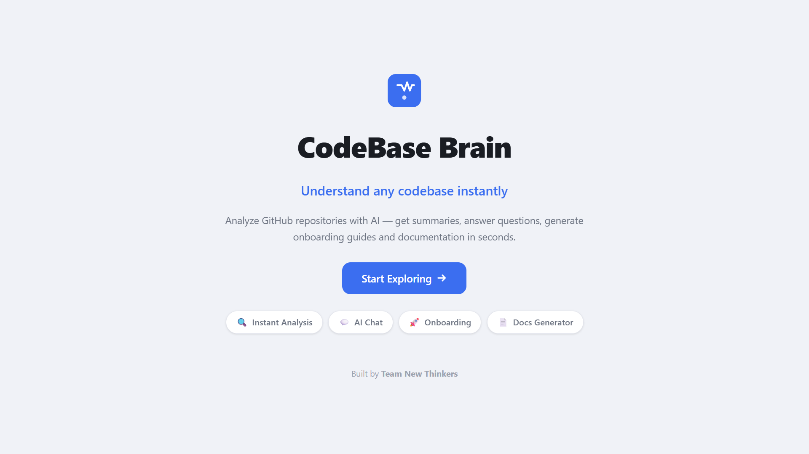
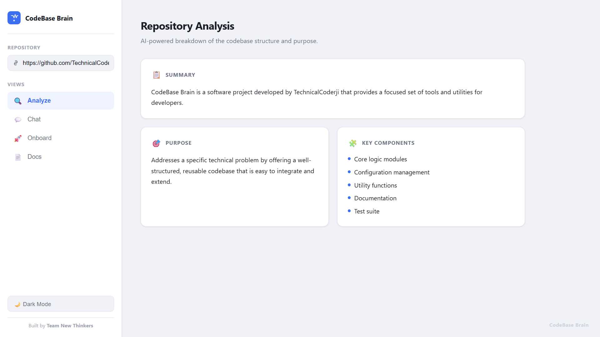
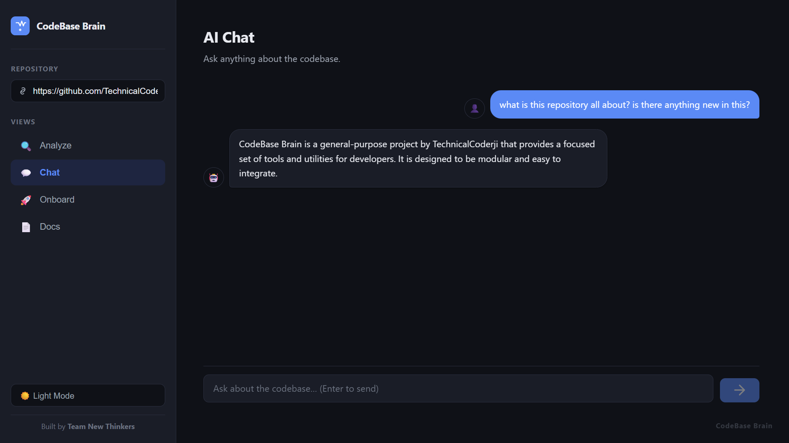
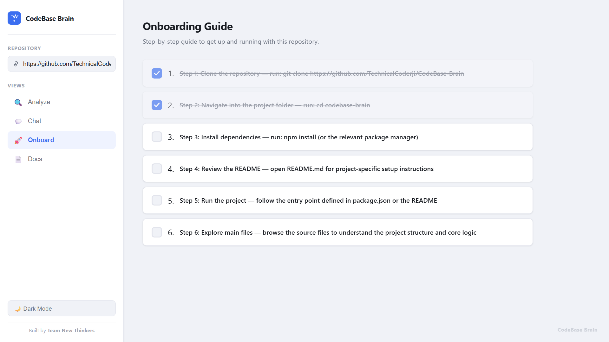
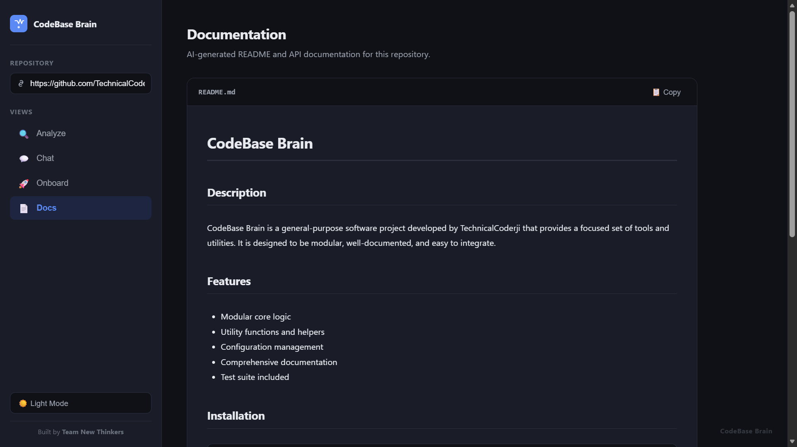

# 🧠 CodeBase Brain

> **Understand any codebase instantly**

CodeBase Brain is an AI-powered platform that lets developers analyze, understand, and interact with any GitHub repository. Paste a repo URL and instantly get deep insights, interactive Q&A, onboarding guides, and auto-generated documentation — all powered by IBM watsonx.ai.

---

## ✨ Features

| Feature | Description |
|---|---|
| 🔍 **Repository Analysis** | Fetches and parses a GitHub repository's file tree and source code, giving a structured understanding of the entire project. |
| 💬 **Chat with Codebase** | Ask natural-language questions about any part of the repo. Get precise, context-aware answers grounded in the actual code. |
| 🚀 **Onboarding Guide** | Generates a beginner-friendly onboarding walkthrough so new contributors can get up to speed fast. |
| 📄 **Auto Documentation Generator** | Automatically produces clean, readable documentation for the repository's modules, functions, and overall architecture. |

---

## 🛠️ Tech Stack

| Layer | Technology |
|---|---|
| **Frontend** | React 18 + Vite 5 |
| **Backend** | Node.js + Express 4 |
| **AI / LLM** | IBM watsonx.ai (Granite models via watsonx API) |
| **Development** | IBM BOB-assisted development |

---

## 📸 Screenshots

| Landing Page | Repository Analysis |
|---|---|
|  |  |

| Chat with Codebase | OnBoard |
|---|---|
|  |  |

| Documentation Generator |
|---|
|  |

---

## 🌐 Demo

**Live Demo:** [https://your-deployed-link.com](https://codebasebrain.netlify.app/)

> _Replace the link above with your deployed application URL._

---

## 📦 Installation

### Prerequisites

- [Node.js](https://nodejs.org/) v18 or higher
- [npm](https://www.npmjs.com/) v9 or higher
- An [IBM Cloud](https://cloud.ibm.com/) account with watsonx.ai access
- A GitHub Personal Access Token (for private repo access, optional)

---

### 1. Clone the Repository

```bash
git clone https://github.com/your-username/codebase-brain.git
cd codebase-brain
```

---

### 2. Backend Setup

```bash
cd backend
npm install
```

Create a `.env` file by copying the example:

```bash
cp .env.example .env
```

Open `.env` and fill in your IBM watsonx.ai credentials:

```env
# IBM watsonx.ai credentials
WATSONX_URL=https://us-south.ml.cloud.ibm.com
WATSONX_API_KEY=your_ibm_cloud_api_key_here
WATSONX_PROJECT_ID=your_watsonx_project_id_here

# Optional — defaults to ibm/granite-13b-instruct-v2
# WATSONX_MODEL_ID=ibm/granite-13b-instruct-v2
```

Start the backend server:

```bash
# Development (with auto-reload)
npm run dev

# Production
npm start
```

The backend runs on **http://localhost:3000** by default.

---

### 3. Frontend Setup

Open a new terminal:

```bash
cd frontend
npm install
npm run dev
```

The frontend runs on **http://localhost:5173** by default.

---

## 🚀 Usage

### 1. Analyze a Repository

1. Open the app in your browser at `http://localhost:5173`.
2. On the **Landing Page**, enter a GitHub repository URL (e.g. `https://github.com/facebook/react`).
3. Click **Analyze** — the platform fetches the repo structure and indexes the code.

### 2. Chat with the Codebase

1. After analysis, navigate to the **Chat** tab.
2. Type any question about the code (e.g. _"What does the AuthController do?"_ or _"How is routing configured?"_).
3. The AI responds with context-aware answers sourced directly from the repository.

### 3. Generate an Onboarding Guide

1. Go to the **Onboarding** tab.
2. Click **Generate Guide**.
3. A step-by-step guide is produced — covering project structure, setup instructions, and key files — ready to share with new contributors.

### 4. Auto-Generate Documentation

1. Navigate to the **Docs** tab.
2. Click **Generate Docs**.
3. Structured documentation is generated covering modules, exported functions, and the overall architecture of the repository.

---

## 🗂️ Folder Structure

```
codebase-brain/
├── backend/                  # Node.js + Express API
│   ├── controllers/
│   │   ├── analyzeController.js   # Repository parsing logic
│   │   ├── askController.js       # Chat / Q&A logic
│   │   ├── docController.js       # Documentation generation
│   │   └── onboardController.js   # Onboarding guide generation
│   ├── routes/               # Express route definitions
│   ├── services/             # Shared services (watsonx client, GitHub fetcher)
│   ├── app.js                # Express app entry point
│   └── .env.example          # Environment variable template
│
├── frontend/                 # React + Vite SPA
│   ├── src/
│   │   ├── pages/
│   │   │   ├── LandingPage.jsx
│   │   │   ├── AnalyzeView.jsx
│   │   │   ├── ChatView.jsx
│   │   │   ├── OnboardView.jsx
│   │   │   └── DocsView.jsx
│   │   ├── components/       # Reusable UI components
│   │   ├── services/         # API call helpers
│   │   └── App.jsx
│   └── vite.config.js
│
├── preview/                  # Images for preview in README.md
│
└── README.md
```

---

## 🔌 API Endpoints

| Method | Endpoint | Description |
|---|---|---|
| `POST` | `/api/analyze` | Analyze a GitHub repository |
| `POST` | `/api/ask` | Ask a question about the analyzed repo |
| `POST` | `/api/onboard` | Generate an onboarding guide |
| `POST` | `/api/doc` | Generate documentation |

---

## 👥 Team

**Team New Thinkers**

Built with curiosity, collaboration, and a lot of coffee ☕.

---

## 📄 License

This project is licensed under the [MIT License](LICENSE).

---

<p align="center">
  Made with ❤️ by <strong>Team New Thinkers</strong>
</p>
